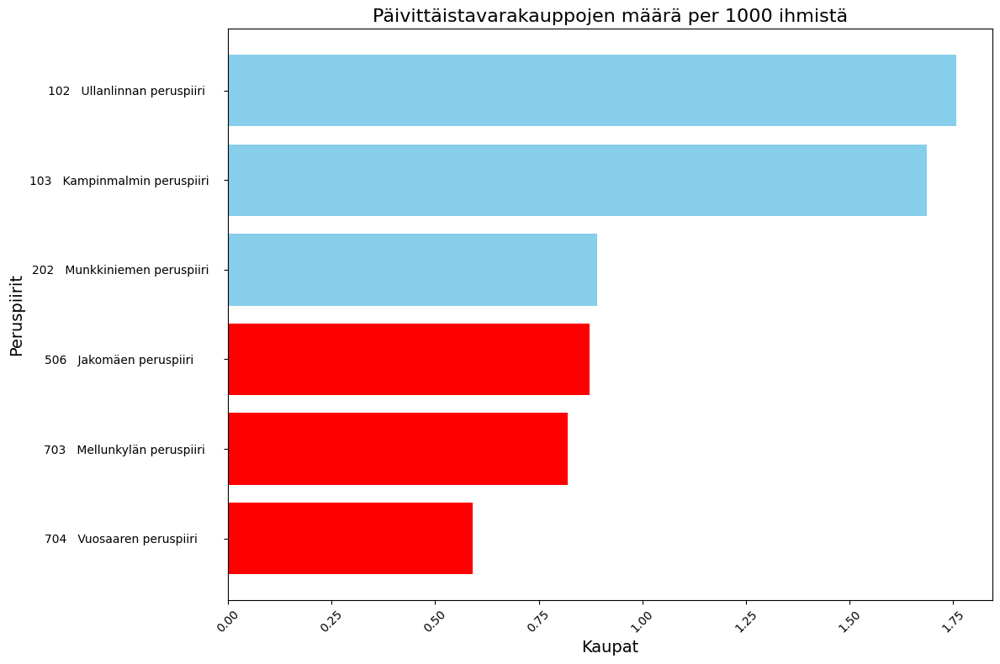
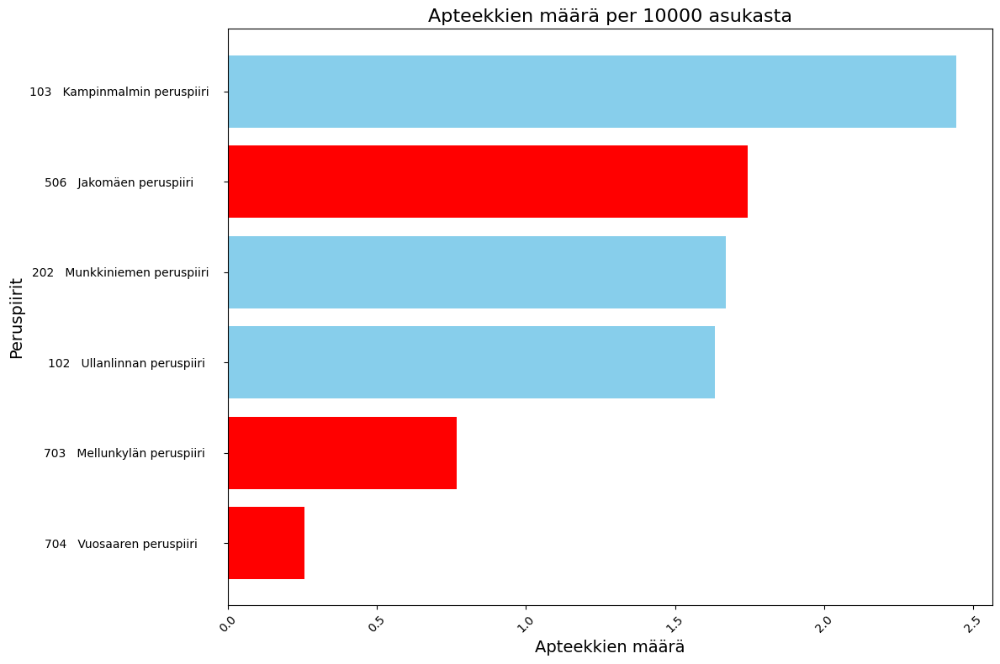

# Services and Demographics in Helsinki

How does the availability of everyday services across Helsinki's postal areas and
districts line up with residents' income and education — and what would it take to
attract and keep high-earning, highly educated residents in the city?

## Findings

- **Service density falls sharply from the centre outward.** Services per capita
  run from 0.044 in the best-served postal areas (00160, 00170) down to 0.004 at
  the low end — an elevenfold spread across the city's 84 postal areas.
- **The same districts lead on both income and education.** Kaivopuisto,
  Marjaniemi, Eira, Kaartinkaupunki and Kuusisaari rank highest on median salary
  against share of educated residents. Jakomäki, Kontula and Itäkeskus rank
  lowest on both.
- **Everyday retail follows the same gradient, roughly 2:1.** Ullanlinna has 1.76
  grocery stores per 1,000 residents and Kampinmalmi 1.69, against 0.82 in
  Mellunkylä and 0.59 in Vuosaari.
- **Service provision does not track income cleanly, and that is the useful
  result.** Jakomäki, among the lowest-income districts, has the second-highest
  pharmacy density of the six districts studied (1.74 per 10,000 residents),
  ahead of affluent Munkkiniemi (1.67) and Ullanlinna (1.63). The genuinely
  underserved district is Vuosaari at 0.25. Meanwhile affluent Munkkiniemi has
  the most crowded daycare centres, around 86 children each, more than Jakomäki's
  82. A policy that simply moved services toward low-income districts would miss
  both of these.

## What this was for

The project asks how Helsinki could attract and retain high-income and highly
educated residents, treating service availability — shops, daycare, pharmacies,
sports facilities — as the lever the city can actually pull. City planners and
anyone making a case for where to site a new service are the audience for the
answer.

## Live output

**[View the interactive map and charts →](https://anastasiiax.github.io/helsinki-services-and-demographics/)**

A choropleth of services per capita across all 84 Helsinki postal areas, plus the
district comparison charts.
[Original Colab notebook](https://colab.research.google.com/drive/1WUox39VmuAN5vDv_pO2UcNvELQzXJMF3?usp=sharing).




## Tech stack

Python, pandas, numpy, plotly, folium, matplotlib, openpyxl, Jupyter.

## How to run

```bash
pip install -r requirements.txt
jupyter notebook helsinki_services_analysis.ipynb
```

All source data is committed under `Source_Data/` and the notebook reads from
there, so it runs from a clone with no extra setup. To regenerate the published
page in `docs/`:

```bash
python scripts/export_html.py
```

That script reads the figures and the services-per-capita table already saved in
the notebook rather than re-running the analysis, so the published page always
matches the committed outputs. It rebuilds only the map geometry, trimmed to the
postal areas that carry data — the copy embedded in the notebook holds every
postal area in Finland and is about 40 MB.

## Analysis

- Extract education and income by region from the Excel headers; compute total
  educated population, average and median salary per region.
- Compute the share of educated residents relative to population in each area.
- Plot median income against educated residents, in absolute numbers and as a
  percentage (Plotly).
- Compute services per capita by postal area and map it as a Folium choropleth.
- Compare selected districts on daycare capacity, playgrounds, sports facilities,
  grocery stores, pharmacies and Alko stores, each normalised per capita.
- Compare employment sector distribution across the same districts.

The six districts compared in detail are Ullanlinna, Kampinmalmi, Munkkiniemi,
Vuosaari, Jakomäki and Mellunkylä.

## Data sources

Helsinki region open data, 2019, committed under `Source_Data/`:

| File | Contents |
|---|---|
| `asuntokuntien_koulutus.xlsx` | Education by household |
| `asuntokuntien_tulot.xlsx` | Income by household |
| `väkiluku_aluettain.xlsx` | Population by area |
| `Helsinki_alueittain_2019.xlsx` | District-level service and employment indicators |
| `palvelut_aluettain_2019.xlsx` | Service counts by postal area |
| `finland-postal-codes.geojson` | Postal code boundaries |

## Notes

Originally a business analytics course project at Metropolia University of
Applied Sciences. The notebook was renamed from
`Liiketoiminta_analytiikan_projekti.ipynb` and its data paths repointed from
Google Drive to the committed `Source_Data/` folder so the analysis runs from a
clone.

## Author

Anastasiia Kosareva.
